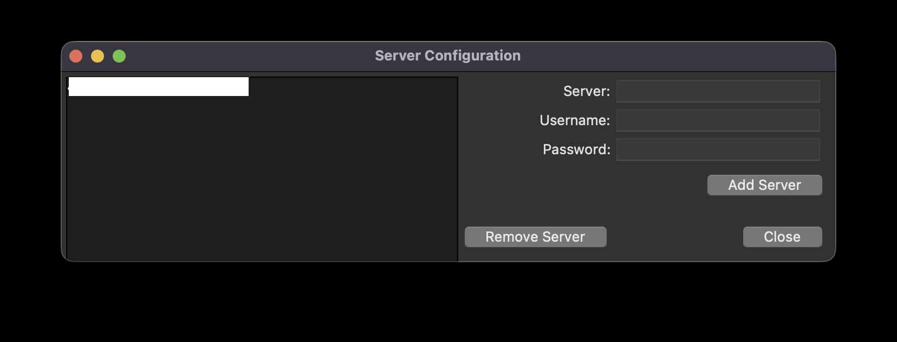
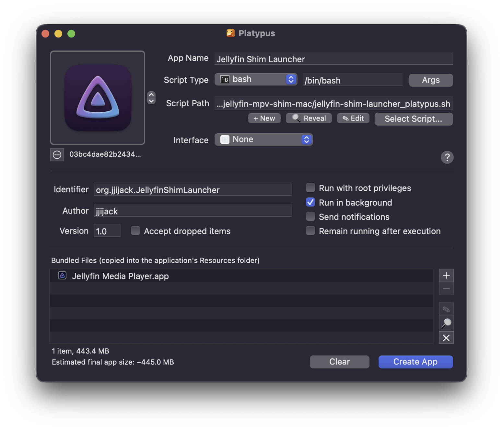

# Jellyfin MPV Shim for macOS

[中文说明](README.zh-CN.md)

An all-in-one solution for a native, stable, and user-friendly [jellyfin-mpv-shim](https://github.com/jellyfin/jellyfin-mpv-shim) experience on macOS.

This project solves the common compatibility issues and cumbersome setup process of using jellyfin-mpv-shim on macOS. It provides an automated installer, a robust launcher application, and a clean uninstaller, aiming for an out-of-the-box experience.

## Features

* **One-Click Installer & Setup (`install.sh`)**
    * **Automated Dependency Management**: Automatically checks for and installs all required dependencies (Homebrew, Python, mpv, pipx, python-tk) using an interactive process.
    * **Graphical Admin Privileges**: When needed, it graphically prompts for an administrator password to install Homebrew, without requiring manual `sudo` commands.
    * **Compatibility Patches**: Automatically patches the `pack-next.json` configuration file to switch the rendering backend to `vulkan` and remove problematic `dither` settings, resolving common playback errors on macOS.
    * **Guided First-Time Login**: On the first run, the installer automatically opens a Terminal window to guide the user through the official Jellyfin server login and authorization process.

* **Native-Like Launcher (`Jellyfin Shim Launcher.app`)**
    * **Simple & Intuitive**: Provides a standard macOS App that can be launched from the Applications folder or Launchpad.
    * **Error Auto-Recovery**: Actively monitors the `shim` service and automatically restarts it in the background if a "Broken pipe" error is detected, ensuring playback continuity.
    * **Intelligent Process Management**: The launcher monitors the main Jellyfin Media Player process and automatically terminates all related `shim` processes when the player is closed, preventing orphaned processes.

* **Standard DMG Distribution**
    * Provides a standard `.dmg` disk image for a familiar drag-and-drop installation experience.
    * Includes a dedicated uninstaller script (`uninstall.sh`) for a clean and complete removal of all components and configuration files.

## Installation & Usage

1.  **Download the DMG**: Go to the [Releases page](https://github.com/jjijack/jellyfin-mpv-shim-mac/releases) and download the latest `Jellyfin.Shim.Launcher.Installer.vX.X.X.dmg` file.
2.  **Run the Installer Script**:
    * Open the DMG file.
    * Open your **Terminal** application.
    * Type `bash ` (note the space after `bash`).
    * Drag the `install.sh` file from the DMG window into the Terminal window.
    * Press **Enter**. The script will guide you through installing all dependencies and the initial login setup.
3.  **Install the App**: After the installer script finishes successfully, drag the `Jellyfin Shim Launcher.app` icon onto the `Applications` folder alias.
4.  **Launch the App**: You can now run `Jellyfin Shim Launcher` from your Applications folder or Launchpad.

### Important Note for First-Time Launch

Due to macOS Gatekeeper, when you first open the `Jellyfin Shim Launcher.app`, you may see a warning that the developer cannot be verified.

To bypass this, **right-click the app icon and select "Open"** from the context menu. This only needs to be done once.

#### Post-Installation Steps

After the first launch, you may need to configure the following settings within Jellyfin:

1.  **Set the Playback Device**
    Please change the "Cast to Device" option to the `jellyfin-mpv-shim` device (usually named after your Mac model, e.g., `MacBook-Pro.local`). This setting typically only needs to be changed once. However, if `jellyfin-mpv-shim` is slow to load, the device may revert to the default Jellyfin player; if this happens, simply select the correct device again.

    

2.  **Enable Anime4K Filters (Optional)**
    The installer automatically configures hotkeys for an easy way to toggle different Anime4K presets during video playback. For a detailed explanation of what each Anime4K filter does, please refer to the [official GLSL Instructions](https://github.com/bloc97/Anime4K/blob/v4.0.1/GLSL_Instructions.md).

    * **Recommended Method (Hotkeys):**
        * **`CTRL + 1` to `CTRL + 6`**: Activate different "Fast" modes of Anime4K. A text overlay (e.g., "Anime4K: Mode A (Fast)") will appear on-screen to confirm the change.
        * **`CTRL + 0`**: Clear all active shaders and return to the default video output.

    * **Alternative Method (On-Screen Menu):**
        You can also press **Enter** during video playback to open the menu. Navigate to `Change Video Playback Profile` and select an Anime4K preset. This choice will also be remembered for future playback.

## Uninstallation

If you wish to remove the application and all its dependencies, please download and run the `uninstall.sh` script from the [Releases page](https://github.com/jjijack/jellyfin-mpv-shim-mac/releases) in your Terminal.

## Usage Notes & Tips

### Modifying Server Configuration

If you entered your server details incorrectly during the first-time setup, or if you need to change servers later, you can do so graphically:

1.  Look for the **Jellyfin MPV Shim icon** in the macOS menu bar (the bar at the top of your screen).
2.  Click the icon and select **"Configure Servers"** from the dropdown menu.
3.  A window will pop up allowing you to edit, add, or remove server configurations.

### Verifying Video Filters (Shaders)

Once a video is playing in mpv, you can check if the video filters (like Anime4K) have been loaded correctly.

Press **Shift+I** to open the on-screen stats, then press the **2** key on your keyboard's top row to cycle to the "User Shaders" page.

* **Success**: If you see a list of shaders starting with `Anime4K`, the filters have been successfully loaded.
* **Failure**: If the list is empty or does not show the expected shaders, the filters were not loaded. Please check your configuration.

### Dock Icon Behavior

Your dock will look like this after launching `Jellyfin Shim Launcher`. Initially, only the official Jellyfin app and a Python rocket indicating Jellyfin MPV Shim will appear. MPV will show up once a video starts playing.

If Jellyfin MPV Shim is terminated (due to an error), its icon will briefly disappear and then reappear as the launcher restarts it. After quitting Jellyfin Media Player, all three icons should disappear.

## Building the App Yourself

For advanced users who prefer to build the application from the source scripts, you can use [Platypus](https://sveinbjorn.org/platypus) to package the launcher.

1.  Download and install Platypus.
2.  Open Platypus and select the `jellyfin-shim-launcher_platypus.sh` script as the "Script Path".
3.  This file could be utilized by Platypus to create an integrated app. `Jellyfin Media Player.app` should be selected as a "Bundled File" by dragging it into the files list.
4.  It is recommended to set "Interface" to "None" and check "Run in background" only.
5.  Set your desired app name and icon, then click "Create App".

## License

This project is licensed under the GNU General Public License v3.0.

This work is a derivative of and designed to be used with [jellyfin-mpv-shim](https://github.com/jellyfin/jellyfin-mpv-shim), which is also licensed under the GPLv3. It incorporates components that may be subject to the MIT License.